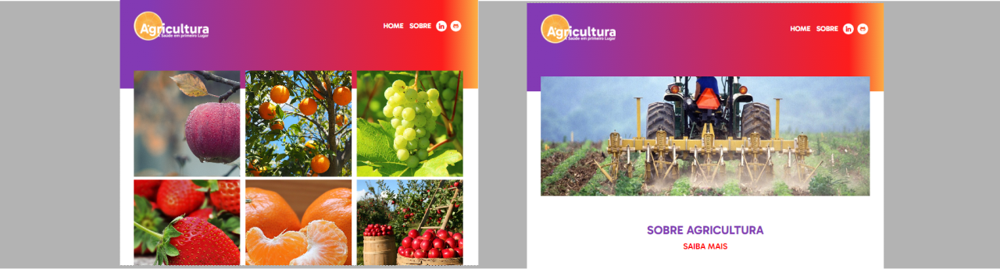
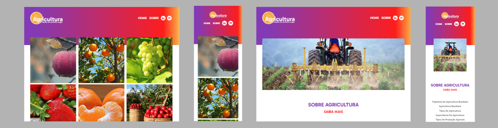

# **React Router Dom**



## Sobre o projeto

Projeto: [trabalho de react js](https://react-router-dom-agricultura.vercel.app/)

Site com rotas aninhadas, sendo utilizado o React Router Dom para reduzir o número de importações em componentes de páginas, deixando o código mais limpo e organizado.

Site with nested routes, using React Router Dom to reduce the number of imports in page components, leaving the code cleaner and more organized.

## Layout web e mobile 



## Tecnologias Utilizadas

* HTML 5
* CSS 3
* Flexbox
* React
* React Router Dom

## Ferramenta de desenvolvimento

<p float="left">
    
</p>

## Instalação do projeto

##### Instalação de dependências via terminal (Installing dependencies via terminal)
```
    npm install
```

## Execução do projeto

##### Iniciar o projeto (Start the project)
```
    npm start
```

## Autor

#### **Katarine Albuquerque**

<p float="left">
    <a href="https://www.linkedin.com/in/katarine-albuquerque/" target="_blank">
        
    </a>
    &nbsp;
    <a href="mailto:kba.2879@gmail.com" target="_blank">
        
    </a>
</p>
